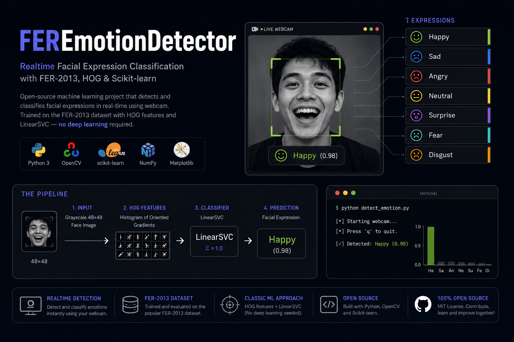

# FEREmotionDetector



Project ini adalah contoh sederhana facial expression classification dengan FER-2013, HOG feature extraction, dan scikit-learn.

Pipeline yang dipelajari:

```text
Image
-> Pixel
-> Preprocessing
-> Feature Extraction
-> X dan y
-> Train/Test Split
-> model.fit()
-> Evaluation
-> Save Model
-> Webcam
-> Realtime Prediction
```

Project ini tidak memakai TensorFlow, PyTorch, Keras, YOLO, atau deep learning.

## Struktur Project

```text
FEREmotionDetector/
├── dataset/
├── models/
│   └── emotion_model.pkl
├── src/
│   ├── dataset_loader.py
│   ├── preprocessing.py
│   ├── features.py
│   └── face_detection.py
├── inspect_dataset.py
├── visualize_features.py
├── train.py
├── evaluate.py
├── camera.py
├── requirements.txt
└── README.md
```

Letakkan dataset FER-2013 seperti ini:

```text
dataset/
├── train/
│   ├── angry/
│   ├── disgust/
│   ├── fear/
│   ├── happy/
│   ├── sad/
│   ├── surprise/
│   └── neutral/
└── test/
    ├── angry/
    ├── disgust/
    ├── fear/
    ├── happy/
    ├── sad/
    ├── surprise/
    └── neutral/
```

Jika dataset hanya punya satu folder berisi subfolder class, loader tetap bisa dipakai. `train.py` akan memakai `train_test_split`.

## Install

Disarankan memakai virtual environment agar dependency project tidak bercampur dengan package global:

```bash
python -m venv .venv
source .venv/bin/activate
pip install -r requirements.txt
```

Jika memakai Fedora dan webcam bermasalah dengan `opencv-python` dari pip, pakai OpenCV bawaan Fedora:

```bash
sudo dnf install python3-opencv v4l-utils
python -m pip uninstall opencv-python
```

Jika tidak memakai virtual environment, install dependency langsung:

```bash
pip install -r requirements.txt
```

## Quick Start

Masuk ke folder project:

```bash
cd ~/Documents/Projects/MotionDetection
```

Cek dataset:

```bash
python inspect_dataset.py
```

Jalankan evaluasi model yang sudah ada:

```bash
python evaluate.py
```

Jalankan webcam:

```bash
python camera.py
```

Jika kamera tidak ada di `/dev/video0`, cek device kamera:

```bash
v4l2-ctl --list-devices
```

Contoh output:

```text
USB Composite Device: DV20 USB:
    /dev/video1
    /dev/video2
```

Jalankan dengan device yang benar:

```bash
python camera.py /dev/video1
```

Tekan `q` untuk keluar dari window webcam.

## Training Ulang

Jika ingin membuat ulang model dari dataset:

```bash
python train.py
```

Model akan disimpan ke:

```text
models/emotion_model.pkl
```

Setelah training selesai, jalankan:

```bash
python evaluate.py
python camera.py /dev/video1
```

## Image Menjadi Angka

Image FER-2013 biasanya grayscale berukuran:

```text
48 x 48
```

Artinya satu image berisi:

```text
2304 pixel
```

Setiap pixel memiliki intensitas:

```text
0   -> hitam
255 -> putih
```

Contoh matrix pixel:

```text
[
  [12, 14, 20],
  [24, 31, 40],
  [80, 94, 101]
]
```

Jika langsung di-flatten, satu image menjadi 2304 raw pixel features. Project ini memakai HOG agar feature lebih mewakili bentuk dan tepi wajah.

## Preprocessing

Function utama ada di `src/preprocessing.py`:

```python
face = preprocess_image(face)
```

Yang dilakukan:

1. baca image jika input berupa path
2. convert ke grayscale jika image masih RGB/BGR
3. resize ke `48x48`
4. optional histogram equalization

Tidak ada preprocessing berat supaya alurnya mudah dipahami.

## Feature Extraction

Feature utama project ini adalah HOG:

```text
Image
-> 48x48 pixel matrix
-> HOG
-> Feature Vector
```

HOG membantu menangkap:

```text
edge
gradient
bentuk mata
bentuk mulut
kontur wajah
```

Konfigurasi HOG ada di `src/features.py`:

```python
orientations=9
pixels_per_cell=(8, 8)
cells_per_block=(2, 2)
block_norm="L2-Hys"
```

Untuk image `48x48`, `pixels_per_cell=(8, 8)` menghasilkan grid 6x6 cell. Dengan block 2x2, jumlah block menjadi 5x5. Total feature:

```text
5 x 5 x 2 x 2 x 9 = 900
```

Jadi setiap image menjadi vector dengan 900 angka, bukan lagi matrix 48x48.

## X dan y

`X` berisi feature vector dari image.

Contoh:

```text
dataset/train/happy/123.jpg
```

menjadi:

```python
X[index] = [0.21, 0.04, 0.33, ...]
y[index] = "happy"
```

Jika:

```text
X.shape = (28709, 900)
```

artinya:

```text
28709 image
900 feature setiap image
```

`y` berisi label class:

```text
happy
sad
neutral
...
```

## Train/Test Split

Jika dataset punya folder resmi:

```text
dataset/train
dataset/test
```

`train.py` akan memakai pembagian resmi FER-2013. Test set tidak ikut training.

Jika dataset hanya punya satu folder class, `train.py` memakai:

```python
train_test_split(
    X,
    y,
    test_size=0.2,
    random_state=42,
    stratify=y
)
```

`stratify=y` menjaga proporsi class tetap mirip antara train dan test.

## Model

Model yang dipakai:

```python
Pipeline([
    ("scaler", StandardScaler()),
    ("model", LinearSVC(class_weight="balanced"))
])
```

`LinearSVC` cocok sebagai baseline untuk HOG karena HOG menghasilkan feature vector numerik berdimensi cukup tinggi. Linear model biasanya lebih ringan daripada RandomForest untuk puluhan ribu image dengan ratusan feature.

`class_weight="balanced"` membantu karena FER-2013 tidak seimbang, terutama class `disgust` yang jumlahnya jauh lebih sedikit.

Scaler dimasukkan ke `Pipeline` agar scaler hanya belajar dari training data. Ini membantu menghindari data leakage.

## model.fit()

Ketika menjalankan:

```python
model.fit(X_train, y_train)
```

model mencoba menemukan pola feature yang membedakan:

```text
Happy
vs
Sad
vs
Angry
vs
...
```

## Evaluation

Evaluasi memakai:

```python
accuracy_score
classification_report
confusion_matrix
```

Jalankan:

```bash
python evaluate.py
```

atau lihat hasil evaluasi langsung setelah:

```bash
python train.py
```

## Save Model

Model disimpan ke:

```text
models/emotion_model.pkl
```

File ini berisi model dan metadata sederhana:

```text
image size
HOG parameters
class list
```

Training dan webcam memakai function `extract_features()` yang sama agar konfigurasi HOG tidak berbeda.

## Prediction

Untuk satu wajah:

```python
face = preprocess_image(face)
features = extract_features(face)
prediction = model.predict([features])
```

Kenapa memakai:

```python
[features]
```

Karena scikit-learn mengharapkan input berbentuk:

```text
(samples, features)
```

Satu wajah tetap harus berbentuk:

```text
(1, N)
```

bukan:

```text
(N,)
```

## Webcam

Jalankan:

```bash
python camera.py
```

Atau pilih device kamera secara manual:

```bash
python camera.py /dev/video1
```

`camera.py` akan:

- mencari device `/dev/video*` jika tidak diberi argumen
- membuka kamera dengan resolusi `640x480`
- mendeteksi wajah pada frame yang diperkecil agar lebih cepat
- memilih wajah terbesar
- menstabilkan kotak wajah dan label prediksi agar tidak mudah loncat

Alurnya:

```text
Webcam
-> Frame
-> Detect Face
-> Crop Face
-> Grayscale
-> Resize 48x48
-> HOG
-> model.predict()
-> Facial Expression
```

Tekan:

```text
q
```

untuk keluar.

`camera.py` tidak melakukan training. Model hanya di-load satu kali, lalu dipakai untuk inference setiap frame.

### Troubleshooting Webcam

Jika muncul:

```text
Webcam tidak tersedia.
```

Cek device kamera:

```bash
v4l2-ctl --list-devices
ls -l /dev/video*
```

Jika user belum punya akses group `video`:

```bash
sudo usermod -aG video $USER
newgrp video
```

Jika `cv2.CascadeClassifier` tidak ditemukan, berarti OpenCV yang terinstall tidak cocok. Install OpenCV 4.x:

```bash
python -m pip install --user --force-reinstall "opencv-python<5"
```

Jika di Fedora `cv2.data` tidak ditemukan, install data OpenCV dari package Fedora:

```bash
sudo dnf install opencv python3-opencv
```

Jika kamera terdeteksi oleh `v4l2-ctl` tetapi Python tidak bisa membaca frame, test kamera di luar Python:

```bash
ffplay /dev/video1
```

Jika `ffplay` juga gagal, masalahnya ada di driver/perangkat kamera, bukan di project.

## Catatan Penting

Output model ditulis sebagai:

```text
Facial Expression: Happy
```

Facial expression classification tidak sama dengan mengetahui perasaan seseorang. Model hanya membaca pola visual wajah dari image, bukan keadaan emosi internal seseorang.

Jika score ditampilkan dari `decision_function()`, score tersebut bukan probability. Karena itu labelnya `Score`, bukan `% probability`.

## Urutan Belajar yang Disarankan

```bash
python inspect_dataset.py
python visualize_features.py
python train.py
python evaluate.py
python camera.py /dev/video1
```
